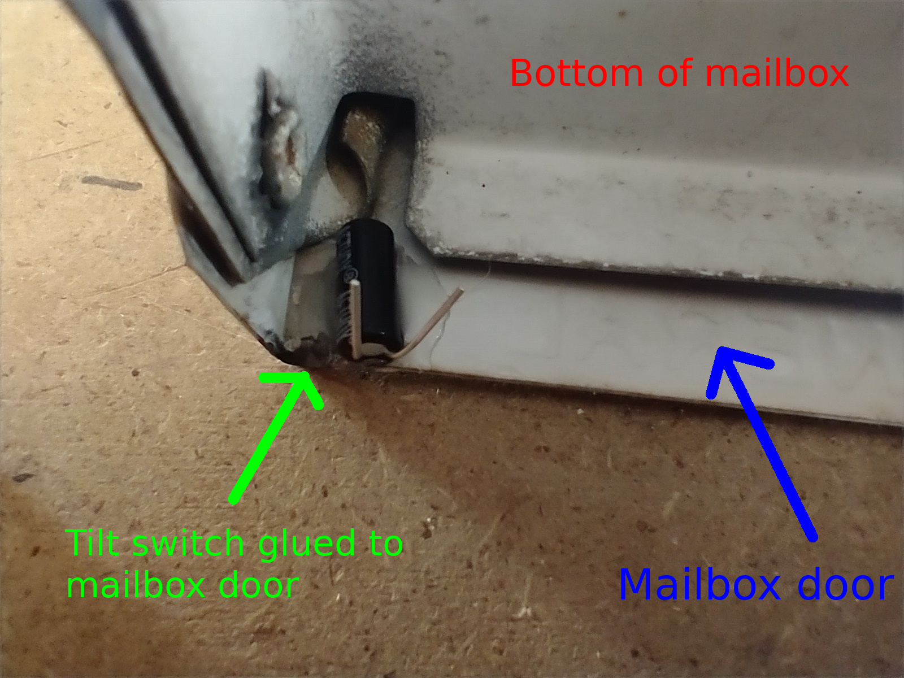

# Hardware Assembly

## Additional items needed.

Soldering iron

Solder

Nipper or wire cutter to remove excess from pins after soldering items

Super glue for mounting the tilt switch on the mailbox door.

Needlenose pliers

Phillips screw driver

3x AA batteries

## Soldering on the voltage regulators
There are two voltage regulators. One provides 3.3v to the Holtek HT68F001 microcontroller, (U2), and the other provides 3.3v to the NodeMCU, with an enable switch (U1).

Solder the MCP1825 voltage regulator into the U1 spot.

Solder the MCP1700 voltage regulator into the U2 spot. The solder mask matches the orientation for the part.

Once those are soldered on, clip off the excess.

## Soldering on the Capacitors

Solder the Capacitors into the C1, C2, C3, C4 and C5 spots. Make sure to orient them correctly. They are polarized and if put in backwards, they will explode.

There is a white line on one side of the capacitor that shows the negative pin. That pin goes into the hole that has the white half of the circle. See the following picture for an example of the capacitor inserted correctly. The arrow shows the white line on the capacitor showing the negative pin.

There is also a positive mark on the board next to each capacitor circle. That is where the positive pin should be inserted.

Clip off the excess.

## Soldering on the Headers for the NodeMCU

Solder the two strips of headers onto the board. Make sure the headers are flush with the board, or else it will be hard to insert the NodeMCU.

## Soldering on the battery holder

The newest board has the markings to show the power connection, J2. The positive, red wire from the battery pack goes in the left most hole of j2. It has a plus sign under it. The negative, black wire from the battery pack goes in the right hole of j2. It has a minus sign under it and white square around the hole.

## Program and insert the NodeMCU

Upload the program for the NodeMCU according to the [software instructions](https://github.com/thinklearndo/garagedooropennotifier/blob/main/SoftwareSetup.md). Then insert it into the headers.

## Mailbox mounting

The tilt sensor needs to be able to detect when the mailbox door is closed and opened, otherwise it won't detect the mail being delivered. I used a type of gorilla glue to mount it vertically on the bottom edge of the mailbox door.

I placed the end with the legs sticking out down, so that when the door is closed, the tilt switch reads closed. Then when the door is opened, the switch will read open.

After gluing it in place and letting the glue dry, slide the heat shrink tubes over the two wires and then solder the wires to the tilt switch legs. It doesn't matter which wire goes to which leg.

Then use a heat gun or blow dryer to shrink the tubing tight over the solder joints on the tilt switch.

Run the wires back to the spot where the main circuit board will rest. With my vinyl mailbox holder, I stuck it in the vertical post and ran the wires in through the gaps where the horizontal post goes through.

Solder in the wires from the tilt switch into the SW1 spot. Once again it doesn't matter which wire goes in which hole.

Insert 3aa batteries and verify that it can detect the mailbox door opening and closing.

